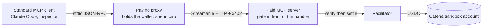

# x402-mcp-demo

An MCP server whose tool invocations are metered and charged over x402, plus
a paying-proxy reference client that lets any standard MCP client use the
paid tool without knowing x402 exists. Settlement is real testnet USDC on
Base Sepolia, landing in a Catena sandbox account.



## How it works

The x402 challenge lives at the HTTP layer of the MCP Streamable HTTP
transport, underneath the JSON-RPC framing, so the MCP protocol itself is
untouched and standard clients stay compatible.

- `initialize`, `tools/list`, and the free `pricing` tool cost nothing.
- `tools/call` on `premium_market_signal` draws a 402 with an x402 v2
  challenge (exact scheme). The proxy pays it, the facilitator settles into
  the configured `payTo`, and only then does a successful tool result return.
  Middleware order is the invariant: unpaid calls never reach the tool
  handler; MCP HTTP 4xx cancels settlement.
- The proxy refuses a paid call BEFORE paying when its running total would
  pass `PROXY_SPEND_CAP_USD`. The cap is configuration, never derived from
  tool arguments, so a prompt-injected tool call cannot raise it.

The call-by-call sequence, including where settlement is cancelled, is in
[docs/architecture.md](docs/architecture.md).

## Setup

Requires Node >= 22.13 (see `.nvmrc`) and pnpm.

```sh
corepack enable
pnpm install
cp .env.example .env
# SELLER_PAY_TO_ADDRESS: your Catena sandbox account's base-sepolia USDC
#   deposit address, from app.catena.com
# BUYER_EVM_PRIVATE_KEY: a testnet wallet the proxy pays from. Fund it with
#   Base Sepolia USDC at https://faucet.circle.com (select Base Sepolia).
#   USDC only; no ETH is needed, transfers are gasless EIP-3009.
```

Both entry points exit `2` when configuration is missing or invalid, and `1`
when a dependency they need is unreachable (the facilitator for the server,
the upstream MCP server for the proxy).

## Demo: the whole loop in one command

```sh
pnpm demo
```

Boots the paid server against the public x402 facilitator, drives a standard
MCP client through the paying proxy, and prints: free discovery, then the
paid tool call settling $0.001 of testnet USDC into the Catena deposit
address.

## See the 402 yourself

Run `pnpm server` in one terminal, then ask for the paid tool without paying.
The server answers `/healthz` with its price and paid-tool name, which is
also what the proxy probes at startup:

```sh
curl -s http://localhost:4040/healthz
```

```
{"status":"ok","paidTool":"premium_market_signal","price":"$0.001"}
```

The challenge itself travels in the `PAYMENT-REQUIRED` response header, not
in the body (the body is `{}`), so decode the header to read it:

```sh
curl -si -X POST http://localhost:4040/mcp \
  -H 'content-type: application/json' \
  -H 'accept: application/json, text/event-stream' \
  -d '{"jsonrpc":"2.0","id":1,"method":"tools/call","params":{"name":"premium_market_signal","arguments":{"topic":"usdc"}}}' \
  | grep -i '^payment-required:' | tr -d '\r' | cut -d' ' -f2 | base64 -d
```

```
{"x402Version":2,"error":"Payment required","resource":{"url":"http://localhost:4040/mcp","description":"One invocation of the premium_market_signal MCP tool","mimeType":""},"accepts":[{"scheme":"exact","network":"eip155:84532","amount":"1000","asset":"0x036CbD53842c5426634e7929541eC2318f3dCF7e","payTo":"0x000000000000000000000000000000000000dEaD","maxTimeoutSeconds":300,"extra":{"name":"USDC","version":"2"}}]}
```

Drop `| grep ...` to see the status line: `HTTP/1.1 402 Payment Required`.
The tool never ran, so nothing settled.

## Use it from Claude Code (standard client)

Run the paid server in one terminal (`pnpm server`), then register the proxy
as an ordinary stdio MCP server in `.mcp.json`:

```json
{
  "mcpServers": {
    "paid-market-signal": {
      "command": "pnpm",
      "args": ["--dir", "/path/to/x402-mcp-demo", "proxy"]
    }
  }
}
```

The proxy reads `BUYER_EVM_PRIVATE_KEY` and `UPSTREAM_MCP_URL` from this
repo's own `.env`, so no secret goes into `.mcp.json`. (`.mcp.json` is
gitignored here anyway; keep it that way if you copy this setup.)

Claude Code lists both tools and calls them normally; the proxy pays the 402
behind the scenes. MCP Inspector works the same way:
`npx @modelcontextprotocol/inspector pnpm proxy`.

## Tests

`pnpm test` runs the server and proxy suites against an in-process server
with a recording fake facilitator: no network, no money. Each money-path
invariant has a test that fails if it breaks.

| Invariant                                          | Test                                                                       |
| -------------------------------------------------- | -------------------------------------------------------------------------- |
| Discovery and free tools cost nothing              | serves initialize, tools/list and free tools without any payment           |
| An unpaid paid-tool call gets a 402 before it runs | rejects an unpaid paid-tool call with a 402 challenge before the tool runs |
| A paid call settles exactly once                   | runs the paid tool once the client pays, and discovery stays free after    |
| Discovery stays free through the proxy too         | keeps free surfaces free through the proxy                                 |
| A standard client pays without knowing x402 exists | pays for the paid tool transparently and returns its result                |
| A JSON-RPC batch is refused, never gated per item  | rejects JSON-RPC batch requests outright (fail closed)                     |
| MCP HTTP 4xx cancels settlement                    | does not settle when a paid call returns MCP HTTP 4xx                      |
| A notification (no id) is never charged            | does not charge a notification-shaped paid tools/call (no id)              |
| An unparsable body is refused, not priced          | refuses a paid tools/call sent as text/plain, unparsed and uncharged       |
| One upstream execution per paid call               | posts a paid call twice (402 then paid retry) and settles once             |
| Only USDC on the pinned network is ever signed     | refuses an off-policy challenge (wrong network, wrong asset) unsigned      |
| The spend cap binds before any payment             | refuses a call past the spend cap before any payment                       |
| Concurrent calls cannot both slip under the cap    | caps concurrent paid calls: only one of two settles under a one-call cap   |

## Scope

Public surfaces only: the MCP TypeScript SDK, the public x402 packages and
facilitator, and a Catena sandbox account as the receiving side. Versions and
limits: [docs/architecture.md](docs/architecture.md).

## License

MIT
