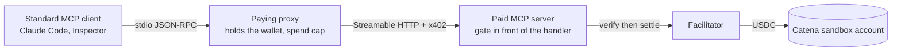
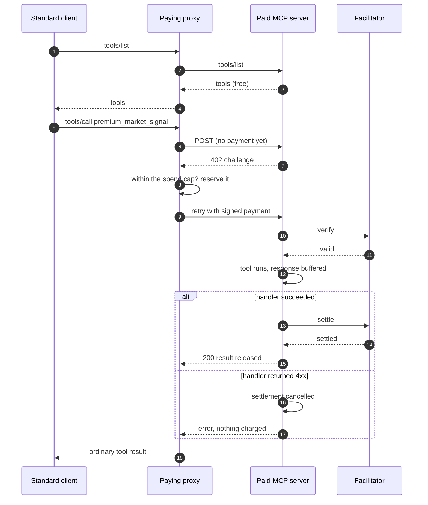

# catena-x402-mcp-demo

An MCP server whose tool invocations are metered and charged over x402, plus
a paying-proxy reference client that lets any standard MCP client use the
paid tool without knowing x402 exists. Settlement is real testnet USDC on
Base Sepolia, landing in a Catena sandbox account.





## How it works

The x402 challenge lives at the HTTP layer of the MCP Streamable HTTP
transport, underneath the JSON-RPC framing, so the MCP protocol itself is
untouched and standard clients stay compatible.

- `initialize`, `tools/list`, and the free `pricing` tool cost nothing.
- `tools/call` on `premium_market_signal` draws a 402 with an x402 v2
  challenge (exact scheme). The proxy pays it, the facilitator settles into
  the configured `payTo`, and only then does a successful tool result return.
  Middleware order is the invariant: unpaid calls never reach the tool
  handler; MCP HTTP 4xx cancels settlement.
- The proxy refuses a paid call BEFORE paying when its running total would
  pass `PROXY_SPEND_CAP_USD`. The cap is configuration, never derived from
  tool arguments, so a prompt-injected tool call cannot raise it.

More detail: [docs/architecture.md](docs/architecture.md).

## Setup (sandbox, ~10 minutes)

Requires Node >= 22.13 and pnpm.

```sh
pnpm install
cp .env.example .env
# SELLER_PAY_TO_ADDRESS: your Catena sandbox account's base-sepolia USDC
#   deposit address, from app.catena.com
# BUYER_EVM_PRIVATE_KEY: a testnet wallet the proxy pays from. Fund it with
#   Base Sepolia USDC at https://faucet.circle.com (select Base Sepolia).
#   USDC only; no ETH is needed, transfers are gasless EIP-3009.
```

## Demo: the whole loop in one command

```sh
pnpm demo
```

Boots the paid server against the public x402 facilitator, drives a standard
MCP client through the paying proxy, and prints: free discovery, then the
paid tool call settling ~$0.001 of testnet USDC into the Catena deposit
address.

## Use it from Claude Code (standard client)

Run the paid server in one terminal (`pnpm server`), then register the proxy
as an ordinary stdio MCP server in `.mcp.json`:

```json
{
  "mcpServers": {
    "paid-market-signal": {
      "command": "pnpm",
      "args": ["--dir", "/path/to/catena-x402-mcp-demo", "proxy"]
    }
  }
}
```

The proxy reads `BUYER_EVM_PRIVATE_KEY` and `UPSTREAM_MCP_URL` from this
repo's own `.env`, so no secret goes into `.mcp.json`. (`.mcp.json` is
gitignored here anyway; keep it that way if you copy this setup.)

Claude Code lists both tools and calls them normally; the proxy pays the 402
behind the scenes. MCP Inspector works the same way:
`npx @modelcontextprotocol/inspector pnpm proxy`.

## Tests

`pnpm test` runs the server and proxy suites against an in-process server
with a recording fake facilitator; no network, no money. They prove:
discovery is free, an unpaid paid-tool call is refused with a 402 before the
tool runs, a paid call settles exactly once, MCP 4xx does not settle, and
the proxy refuses an over-cap call before any payment.

## Scope

Consumes public surfaces only: the MCP TypeScript SDK (v1, protocol
2025-11-25; the v2 SDK targeting the 2026-07-28 spec is beta, and migration
is import-path-level), the public x402 packages and facilitator, and a
Catena sandbox account as the receiving side.

## License

MIT
