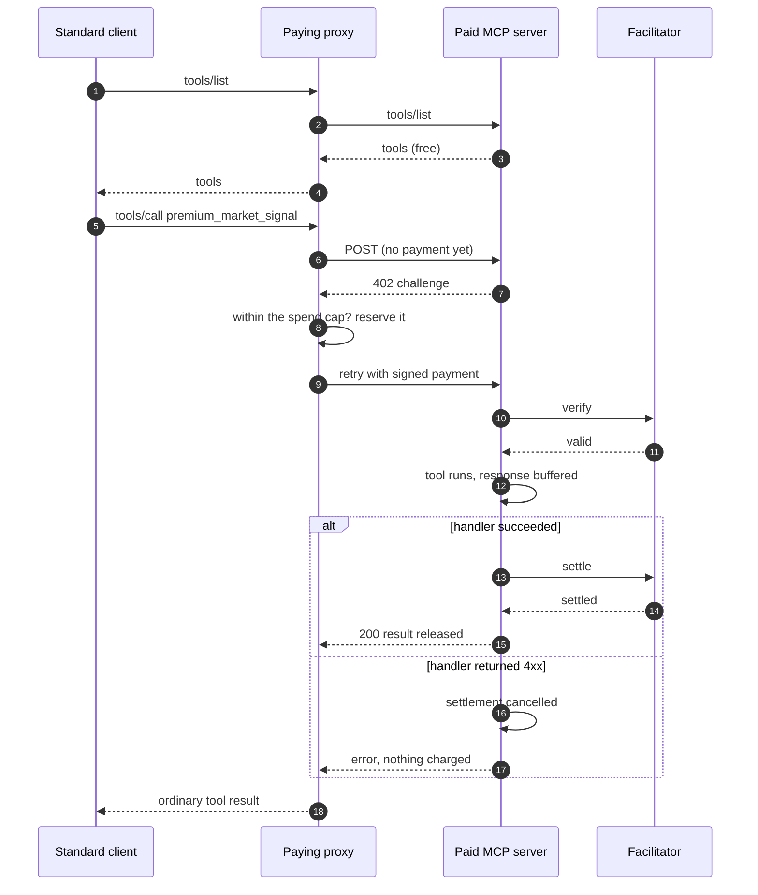

# Architecture

The component diagram is in the [README](../README.md). This is the
call-by-call sequence behind it.

## The invariant: payment before tool

The x402 challenge lives at the HTTP layer of the Streamable HTTP
transport, underneath MCP's JSON-RPC framing, so the MCP protocol is
untouched and standard clients stay compatible. Express middleware order
is the security boundary: unpaid or invalid payment never reaches the MCP
handler. After payment verifies, the handler runs and `@x402/express`
settles only when the HTTP status is `< 400` (this repo syncs
`res.statusCode` from the transport's `writeHead` so MCP 4xx responses
cancel settlement instead of charging for a failed call). Discovery
(`initialize`, `tools/list`) and free tools pass unpaid.

Four hardening choices worth knowing:

- **Batches fail closed.** The SDK's transport tolerates JSON-RPC batch
  arrays from legacy protocol revisions, and a batch could smuggle a paid
  tools/call past a single-message gate. The server rejects arrays with a
  400 instead of gating per element.
- **Per-request server instances.** The transport is stateless and each
  request gets a fresh McpServer, so no state leaks between paid calls.
- **Notifications are not charged.** A `tools/call` without a JSON-RPC
  `id` never runs the tool; the gate ignores it so it cannot settle.
- **Unparsable bodies are refused, not priced.** `express.json()` leaves a
  non-JSON content type unparsed, which would reach the gate as a shapeless
  value. Those get a 415 before the gate runs.

## The proxy: how a standard client pays without knowing it

The reference client is a stdio MCP server the standard client spawns from
`.mcp.json`. It forwards `tools/list` verbatim and forwards `tools/call`
through a fetch wrapped with x402 payment. A paid tool's first POST earns
the 402 (the tool has not run), the wrapper pays and retries: one upstream
execution per call, no separate price probe.

The spend cap binds where signing happens: a payment policy on the x402
client filters out any challenge the remaining budget cannot cover and
reserves the chosen amount synchronously in the same tick. No await
separates check from reservation, so concurrent tool calls cannot both
slip under the cap. A payment that later fails leaves its reservation in
place: conservative in the only safe direction (the proxy can underspend
its cap, never overspend it). The cap is configuration; nothing derived
from tool arguments can raise it, so a prompt-injected tool call cannot
spend more.

The policy also pins what may be signed at all: USDC on the configured
network, an integer amount, and a challenge lifetime under 600 seconds.
The SDK hands policies unparsed JSON, so this parse is the real boundary,
and a challenge in another token is refused rather than mis-priced.

Validated with a real standard client: MCP Inspector 2.1.0 (CLI mode) listed
both tools through the proxy on 2026-08-11. The paid path was driven the same
way against the live facilitator, and the settlement appeared in the Catena
ledger.

## SDK and spec versions

Pinned to `@modelcontextprotocol/sdk` v1 (1.30.0). `2025-11-25` is the
latest protocol revision it offers; a client that does not negotiate falls
back to the SDK's `DEFAULT_NEGOTIATED_PROTOCOL_VERSION`, `2025-03-26`. The
v2 SDK targets the 2026-07-28 spec revision (stateless protocol, server
discovery instead of the initialize handshake) but is beta with a moving
API; core APIs are functionally unchanged, so migration is
import-path-level when it stabilizes. The 2026-07-28 spec added no payment
primitive: HTTP-layer x402 under the transport remains the compatible way
to charge for tools.

## Why `exact`

Tool invocations are priced per call with the x402 `exact` scheme, the only
scheme in production. Usage-based settlement (`upto`) exists as a spec
draft without facilitator support; per-invocation flat pricing is also the
natural fit for MCP tools, where one call yields one result.

## Known limits

- **No identity gate.** ACK-ID verification before settlement is the
  composition point with x402-ack-id-demo: its identity middleware
  mounts in front of the payment gate unchanged. Deliberately out of scope
  here to keep each demo single-purpose.
- **Per-call upstream connection.** The proxy opens a fresh MCP connection
  per forwarded call: simple and stateless, at the cost of a handshake per
  call. Fine for a demo; a long-lived upstream session is the obvious
  optimization.
- **Reservation is not released on failed payments.** By design (see
  above): restarting the proxy resets the meter.
